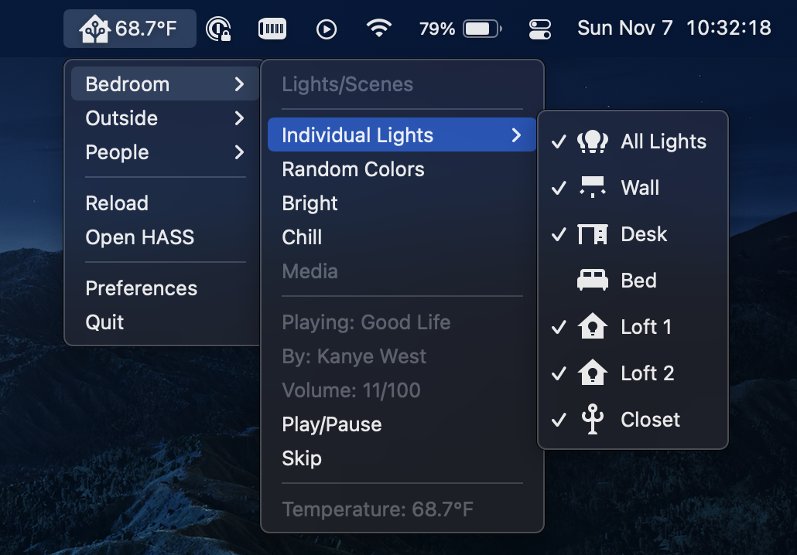
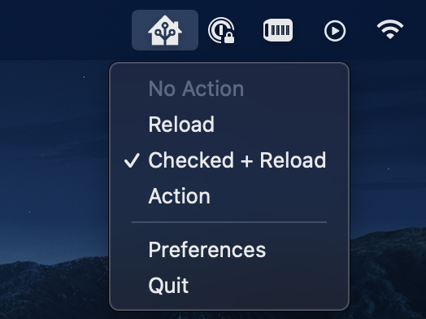
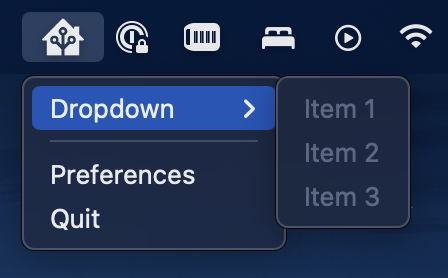
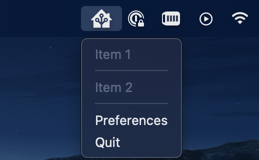

# ha-menu
<br>
An **insanely** customizable way to interact with Home Assistant in the menubar




# Installation

`ha-menu` is still in beta so there are no official builds out at the moment. To build it yourself:

1. Clone this repository 
2. Run `yarn install` <- this may be optional (im too lazy to check)
3. Run `yarn dist`

# App Configuration

To open the Preferences window, click the Home Assistant Icon in your menubar, and then go to `Preferences`. 

* ### `Server URL`
  * #### Example: `http://homeassistant`
  * The URL to your server. Don't add a `/` or a port to the end of the URL.

* ### `Server Port`
  * #### Example: `443`
  * The port to your server. If you use https make sure you put in port `443`.

* ### `Long Lived Access Token`
  * Your long lived access token from home assistant. To make one go to Your Profile -> Long-Lived Access Tokens

# Menubar Configuration

In the preferences window, under `Config` is where you will put the JSON which creates your custom menubar.

* `items` {[`MenuItem`]}: Your list of menu items
* `title` {`String`}: The text that will show up next to the Home Assistant icon in the MenuBar. **Limited to 34 charachters.**

#### Example
```
{
  "items": [
    {
      "type": "label",
      "label": "So much customization!"
    }
  ],
  "title": "Hello World!"
}
```

## Menu Items

There are 4 types of Menu Items

* Dropdown
* Seperator
* Open HASS
* Label

## Type: `label`

* **required** `type`: `label`
* `label`{`String`}: The label for this Menu Item
* `icon` {`String`}: The icon name for this item
* `reload` {`Boolean`}: Whether or not the Menu Bar should be reloaded on click
* `action` {`MenuAction`}: The action to run when clicked
* `checkedTemplate`{`String`}: Whether or not this label should be checked. The string is a Home Assistant template which should resolve to `on`, `true`,`off`, or `false`.
* `hiddenTemplate` {`String`}: Whether or not this label should be hidden. The string is a Home Assistant template which should resolve to `on`, `true`,`off`, or `false`.  

#### Note

* If an item has no `action` and `reload` is not true, the item will be greyed out.

#### Examples


```json
{
  "type": "label",
  "label": "No Action"
},
{
  "type": "label",
  "label": "Reload",
  "reload": true
},
{
  "type": "label",
  "label": "Checked + Reload",
  "reload": true,
  "checkedTemplate": "true"
},
{
  "type": "label",
  "label": "Action",
  "action": {
    "domain": "light",
    "service": "toggle",
    "serviceData": {
      "entity_id": "light.my_light"
    }
  }
}
```

### Type: `dropdown`

Creates a dropdown menu

* **required** `type`: `dropdown`
* **required** `label` {`String`}: The label for this dropdown
* **required** `items` {[`MenuItem`]}: A list of Menu Items to be displayed
* `icon` {`String`}: The icon name for this item

#### Example


```json
{
  "type": "dropdown",
  "label": "Dropdown",
  "items": [
    {
      "type": "label",
      "label": "Item 1"
    },
    {
      "type": "label",
      "label": "Item 2"
    },
    {
      "type": "label",
      "label": "Item 3"
    }
  ]
}
```

## Type: `seperator`

* **required** `type`: `seperator`

#### Example


```json
{
  "type": "normal",
  "label": "Item 1"
},
{
  "type": "seperator"
},
{
  "type": "normal",
  "label": "Item 2"
}
```

## Type: `open_hass`

Looks like a label but opens Home Assistant in your browser when clicked.

* **required** `type`: `open_hass`
* **required** `label` {`String`}: The label for this item
* `icon` {`String`}: The icon name for this item

# `MenuAction`

A `MenuAction` is how you can interact with Home Assistant.

* **required** `domain` {`String`}: The domain to be called
* **required** `service` {`String`}: The service of the domain
* **required** `serviceeData` {{`Service Data`}}: The data that will be given when the service is called

#### Example
```json
{
  "domain" : "light",
  "service": "toggle",
  "serviceData": {
    "entity_id": "light.my_light"
  }
}
```

# Icons

To add an icon to your Menu Bar follow these steps

* Open Preferences
* Click `Open Icons Folder`
* Put all icons in the folder that opens
* On your `MenuItem` add the `icon` field and enter the name of the file **including the file extension**

### Recommendations

* Make the size of your image `32x32`
* Add `@2x` to the end of your file name to make it a "High Resolution Image" (Read below for more information)

## High Resolution Image

To make your image look better in the Menubar you can make it "High Resolution" which increases the DPI. Here are the following options:

* `@1x`
* `@1.25x`
* `@1.33x`
* `@1.4x`
* `@1.5x`
* `@1.8x`
* `@2x`
* `@2.5x`
* `@3x`
* `@4x`
* `@5x`

Just add one of these to the end of your file. 

#### Example
`icon.png` -> `icon@2x.png`

## Icon Templates

It is recommended that your icons are made a template. To make your icon a template

* Your image **must** be only black pixels with a transparent background
* Add `Template` to the end of the name of your file. 

## File Name Examples

* `icon.png` -> `iconTemplate.png`
* `icon@2x.png` -> `iconTemplate@2x.png`

## [More Information Here](https://www.electronjs.org/docs/latest/api/native-image#high-resolution-image)

# Templating

**The customization is not over!** You can also use Home Assistant Templates in certain fields!

## Supported Fields

* `label`
* `icon`
* `title`

## Converting To Templates

To make a field a template just add `Template` to the end of the field name and put your template in the value.

## Example
```json
{
  "labelTemplate": "{{ states('light.my_light') }}"
}
```